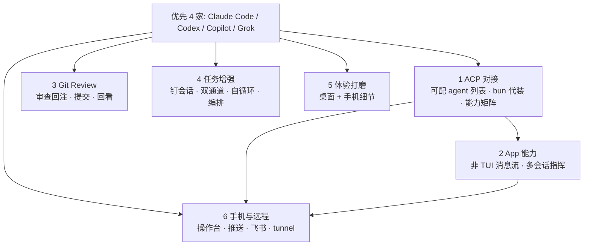
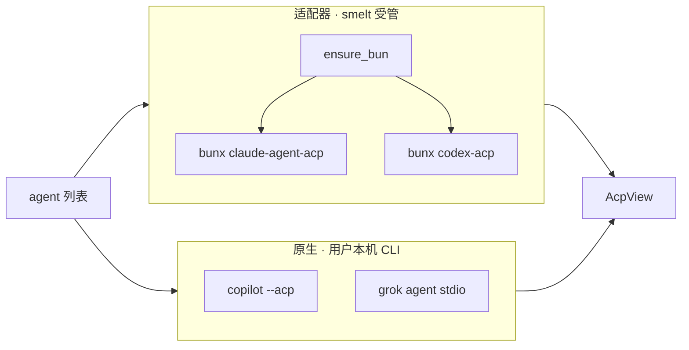
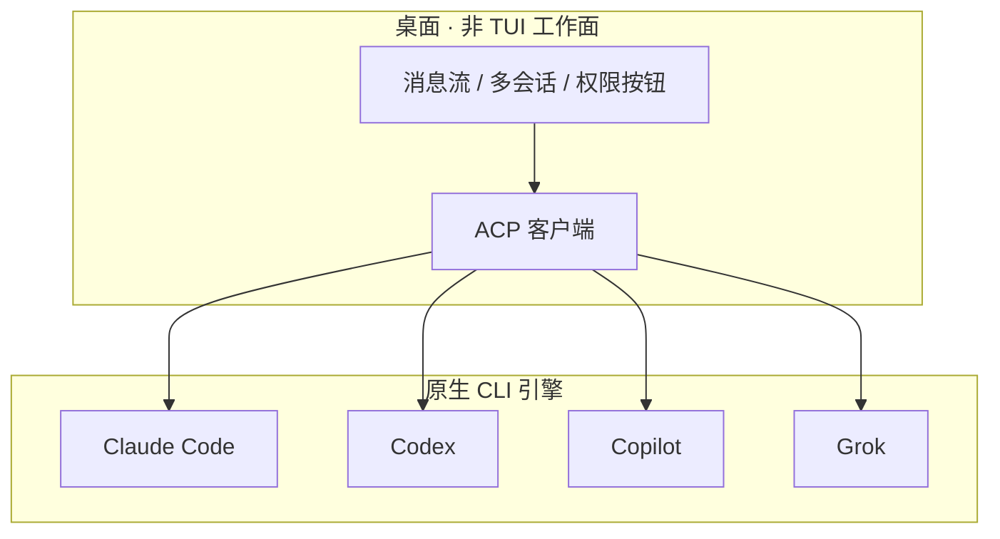
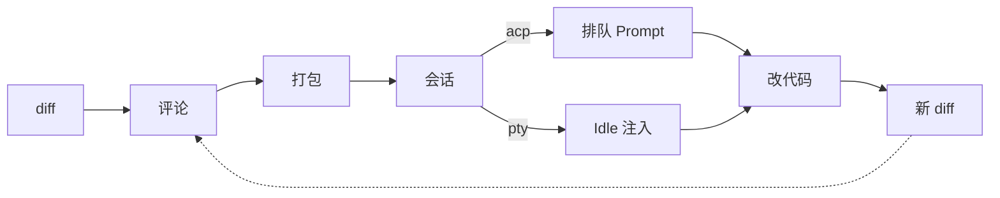
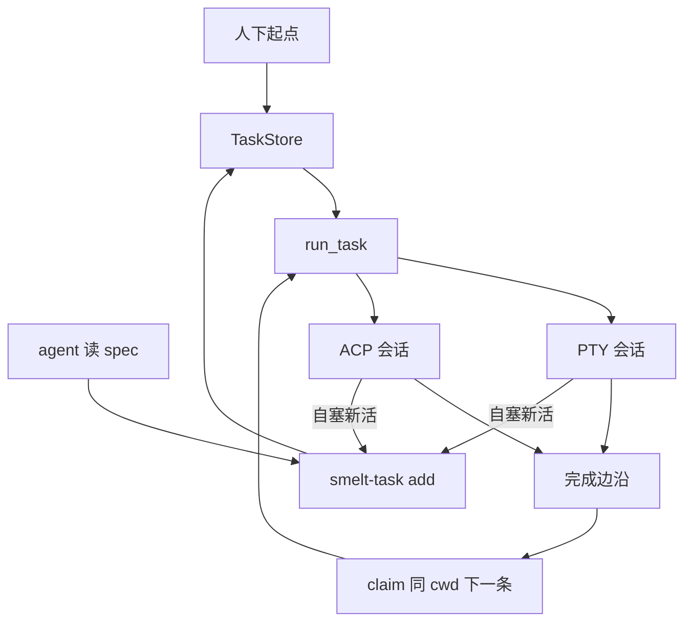
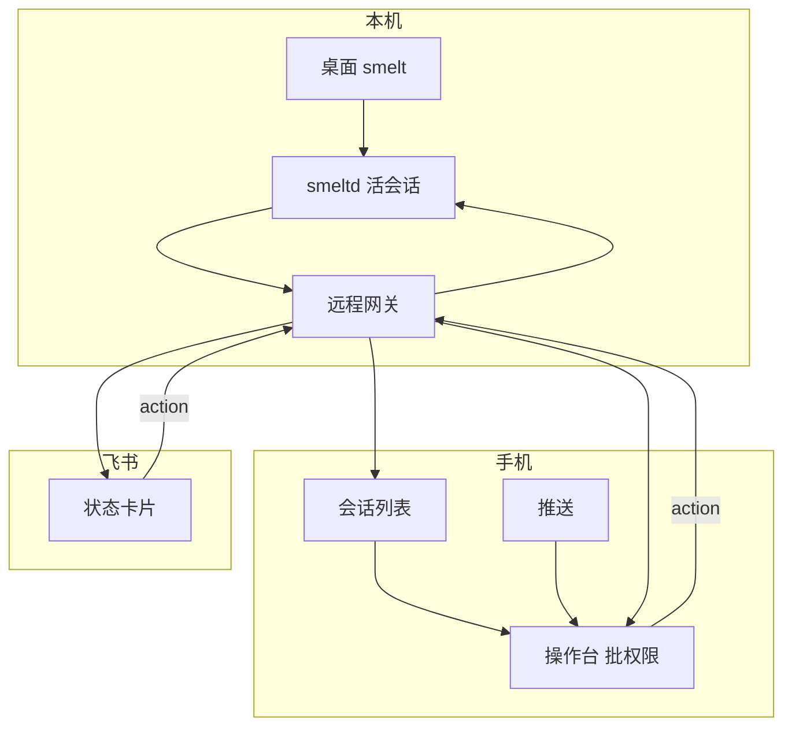

# smelt 产品路线图 · 待做

**优先支持的 4 家 agent：** Claude Code · Codex · Copilot · Grok  
（PTY 快捷启动 + ACP 对接均以这四家为一等公民；其它 CLI 可走 custom，不保证体验。）

对标 Codex Desktop：**多 provider ACP · App 工作面 · Review · 任务编排 · 手机远程 · 体验增强**  
约束：PTY/ACP 二选一 · 权限门不关 · 引擎在本机 · 远程只指挥不搬服务器

杂项点子 → [`roadmap.md`](roadmap.md) · 远程细节 → [`remote-ops-roadmap.md`](remote-ops-roadmap.md)

---

## 总览



---

## 1 · ACP 对接

**不是四家都「CLI 本体原生讲 ACP」。** smelt 只做 ACP **客户端**；对端是「能在 stdio 上说 ACP 的进程」——要么 agent 自带 ACP server，要么中间插一层适配器。

| Provider | ACP 形态 | smelt 怎么交付 | 启动（出厂默认） |
|----------|----------|----------------|------------------|
| **Claude** | **适配器**（`claude-agent-acp`） | **受管 bun 自动拉包** | `bunx @agentclientprotocol/claude-agent-acp@<锁版本>` |
| **Codex** | **适配器**（`codex-acp`） | **受管 bun 自动拉包** | `bunx @agentclientprotocol/codex-acp@<锁版本>` |
| **Copilot** | **原生**（CLI 内置 ACP server） | 用户本机已装 `copilot`；smelt 不代装 CLI | `copilot --acp --stdio` |
| **Grok** | **原生**（Grok Build 官方 ACP） | 用户本机已装 / 官方入口；smelt 不代装 CLI | 以官方 `agent stdio` 为准 |

```text
原生   = agent 进程自己实现 ACP
适配器 = 另起进程，把 Claude/Codex 私有协议翻译成 ACP
```

### 适配器：统一走受管 bun（帮用户下载安装）

沿用现有 Claude 路径（`acp.rs`：`ensure_bun` → `~/.smelt/runtime/bun-v*`）：

1. **首次**用适配器会话 → 若无受管 bun，自动下载锁定版本 bun  
2. `bunx <adapter>@<锁版本>` 由受管 bun 解析/缓存，**用户不必自己装 node/npx/适配器**  
3. 出厂命令**一律 `bunx …@版本`**，不用 `npx`（避免依赖用户系统 Node）  
4. 版本锁定在出厂默认里；设置可「升级到 latest」并写回  
5. 进度文案走 `AcpEvent::Status`（下载中 / 拉包中），失败可读、可重试  

**仍须用户自备的（smelt 不代装）：**  
- Claude 适配器背后的 **Claude Code / 登录**  
- Codex 适配器背后的 **Codex CLI / 登录**  
- Copilot / Grok 的 **本机 CLI + 鉴权**（原生，无适配器可代下）

能力与权限语义（尤其 `request_permission`）**逐家实测**，不假设「接了 ACP = 会弹权限门」。

- [ ] **可配置的 agent 列表**（替单一 `acp_cmd`）：出厂四家 + 用户可增 custom，每项含名称/启动命令
- [ ] Claude + Codex 出厂命令统一 `bunx …@锁版本`；启动前 `ensure_bun` + 拉适配器
- [ ] 侧栏选用哪家 agent；会话记住选的是谁；UI 标注「适配器（smelt 代管）/ 原生（需本机 CLI）」
- [ ] 逐家实测矩阵：`session/load` · `request_permission` · elicitation
- [ ] 启动命令支持引号；下载/拉包错误可读；adapter 版本可锁可升
- [ ] 连接层下沉 smelt-core（为 smeltd 托管 ACP 做准备；见 §6）



---

## 2 · App 能力（ACP 工作面）

**给谁用：** 不喜欢盯 TUI / 不会用终端交互的用户——用原生消息流界面指挥 agent，不必读 ANSI 画面、不必在 TUI 里找权限菜单。  
**定位：** 各家 **原生 CLI**（Claude Code / Codex / Copilot / Grok）经 ACP 接进桌面，做出类似 **NioChat** 的多会话指挥体验——**CLI 当引擎、smelt 当驾驶舱皮肤**，不是再包一层模型 API。PTY 通道仍保留，给需要完整 TUI 的人。

**可参考：**
- **Codex App / Claude Code 桌面** —— 按项目组织多线程、消息流而非盯 TUI、并行长任务、权限/工具可视化
- 同类：AgentHub、Devin Desktop ACP 面板等（只抄「多 agent 工作面」，不抄杀进程/重服务端）

### 待做

- [ ] **P0 消息流工作面**（对标 Codex/Claude 桌面）：tool 卡片折叠 · 行内/附件 diff · turn 中 prompt 排队
- [ ] **P1 多会话指挥**：同项目多线程 · 一键再开/换 provider · Remix 带上下文 · 文件/diff content block
- [ ] **P2** 会话内搜索 · `terminal/*` 代跑真 PTY + 会话内终端面板




---

## 3 · Git · Review

**目标体验：** 在 smelt 内走完 **改动 → 审查 → 回注 agent → 再 diff → 提交 → 回看** 整条链路，不必跳到别的 Git 客户端或飞书里搬评论。

- [ ] **审查闭环：** diff 行内选区 + 评论 → 打包（path/行号/hunk）→ 回注 agent（ACP 排队 / PTY 等 Idle）→ 新 diff 对照
- [ ] **提交体验：** stage/commit/push 手感打磨 · AI commit message · 提交后可一键回到该次 diff
- [ ] **回看：** 轻量 log · 点开单 commit 看 diff · 评论与 commit/sha 关联可回溯
- [ ] 从 diff/tool 跳文件定位 · 外部变更提示 · 分支/stash · 删 worktree 前提示绑会话
- [ ] 联机 review（后置，同一回注管道）



---

## 4 · 任务增强

**目标体验：** 指挥单位是**任务**，会话只是执行现场。人给起点就能走开——队列自动续跑、agent 可自己塞下一条；需要时再点进会话接管。  
（本地骨架与定时/续跑已有，见 [`local-tasks.md`](local-tasks.md)；本节只列增强。）

**给谁用：** 一次丢多件活、想串行/并行盯进度，而不是守着终端一条条喂 prompt 的人。

### 会话 ↔ 任务一体

- [ ] 会话「钉成任务」（标题 / cwd / launch 预填）
- [ ] 任务卡片显示绑定会话相位（PTY 推断 / ACP 协议事实）
- [ ] 右键：改 column、删任务、取消绑定、聚焦会话
- [ ] 总览与侧栏：待办 / 执行中 / 完成筛选；失败态可区分（非一律 Done）

### 开跑与通道

- [ ] `channel = term | acp` + `provider_id`（四家优先）
- [ ] 开跑：PTY 仍用 launch 首包；ACP 则建消息流会话 + 首包 `Prompt`
- [ ] 完成边沿：ACP `TurnEnded` 与 PTY Idle 对称 → 同 cwd claim 下一条
- [ ] auto_run 队列默认倾向 ACP；可强制 PTY；同 cwd 串行策略可配置
- [ ] 失败 / 取消：不误标完成、可重试、可换 provider Remix 再跑

### Agent 自循环

- [ ] `smelt-task add|done|list|…` CLI（或扩展 `smelt-notify` 同源协议）
- [ ] agent 干完可自塞下一条；读 spec / 清单后拆一批任务进同一队列
- [ ] 落盘语义与 UI TaskStore 一致，人与 agent 看到的是同一份列表

### 编排（克制）

- [ ] 轻量依赖：B 等 A done 再 claim（仅本地 FIFO 扩展，不做甘特）
- [ ] 并行：不同 cwd / worktree 可同时跑；同 cwd 默认串行
- [ ] 定时任务体验：到点失败提示、漏跑可补跑
- [ ] 认领池（后置）：等人审批 / 失败任务 / 待 review 与任务列表同一入口



---

## 5 · 体验增强

功能以「能用」为主，细节粗糙。不扩大盘，把已有能力打磨到顺手。

| 面 | 待磨（示例，滚动补充） |
|----|------------------------|
| **终端** | 光标闪烁 · 选区/滚动/粘贴边角 · 重绘与帧感 · 链接/IME 边角 · 空闲与刷屏手感 |
| **侧栏 / 会话** | 标题与相位可读 · 通知不过噪 · 总览卡片信息密度 · 分屏/焦点/快捷键一致 |
| **Git / 文件** | diff 可读与操作反馈 · 大仓性能 · 保存/冲突提示 · 空态与错误文案 |
| **任务** | 卡片状态一眼懂 · 开跑/失败反馈 · 列表筛选与排序手感 |
| **ACP 消息流** | 流式阅读 · 权限卡片布局 · 长 tool 折叠默认策略 · 错误/重连文案 |
| **手机远程** | 小屏信息密度 · 通知与深链 · 弱网/断线重连文案 |
| **设置 / 新手** | 首次引导 · 缺 CLI/未登录可读提示 · 设置项分组与搜索 |
| **全局** | 主题/间距/字号统一 · 加载与空态 · 快捷键表与可发现性 · 窗口/布局恢复边角 |

- [ ] 维护体验债清单，按痛感排序
- [ ] 高频路径优先：开会话 → 看状态 → 批权限（含手机）→ 看 diff → 提交


---

## 6 · 手机与远程

**目标体验：** 人不在电脑前，也能知道 agent 卡在哪、一点允许/拒绝、必要时短回复——**手机是指挥台，不是第二块小终端。**  
引擎与会话仍在本机 smeltd；手机 / 飞书只连网关。

**给谁用：** 开会、通勤、下班后 agent 还在跑，不能坐回 Mac 的人。

配套分层与协议细节见 [`remote-ops-roadmap.md`](remote-ops-roadmap.md)（L1 查看 · L2 知情 · L3 操控 · L4 协作）。

### 手机端（主入口）

- [ ] **会话列表**：各会话相位（跑着 / 等批准 / 等输入 / 完成）· 角标 · 一键进详情
- [ ] **操作台（默认，非 xterm）**：问题摘要 + 允许 / 拒绝 / 短回复；最近输出可折叠看
- [ ] **ACP 会话**：结构化消息流只读 + 权限/选择题原生按钮（比解析 TUI 稳）
- [ ] **PTY 会话**：操作台为主；完整终端画面作二级（小屏慎用）
- [ ] 推送通知：等批准 / 等输入 / 失败（可配置；勿扰）
- [ ] 深链：通知一点进对应会话；鉴权 token / 过期 / 吊销
- [ ] 弱网：断线提示、自动重连、操作失败可重试
- [ ] 形态：先 **手机 H5 / PWA** 可装主屏；原生壳（若需要）后置，API 同一套

### 连接与托管（本机侧）

- [ ] smeltd 托管 **ACP** 子进程 + 事件落盘；GUI / 手机均可 reattach
- [ ] 远程网关：stream / state / input / **action** 契约稳定（手机主走 action）
- [ ] 公网可达：tunnel（如 cloudflared）一键开、状态可见、可关
- [ ] 多端同时看不顶掉桌面 GUI；权限操作幂等、可审计

### 飞书（轻量通道，与手机共用 action）

- [ ] 状态变化推卡片（等批准 / 等输入 / 完成摘要）
- [ ] 卡片按钮 → `approve / deny / reply` → 本机会话
- [ ] 不嵌终端；收件箱零安装



---

## 实施顺序

各线可并行。下表按**线内顺序**展开，覆盖 §1–§6；总览图 = 关系，本表 = 交付切片。

| 线 | 步 | 做（对应正文） | 验收 |
|----|----|----------------|------|
| **ACP** | 1.1 | 可配 agent 列表 · 四家出厂 · bun 代装适配器 · 侧栏选用 | 四家握手并发一轮 prompt |
| | 1.2 | 能力矩阵 · 引号参数 · 错误/版本策略 | 权限语义诚实；失败可读 |
| | 2.0 | 消息流 P0：tool 折叠 · 行内 diff · prompt 排队 | 不看 TUI 完成一轮改代码 |
| | 2.1 | 多会话 · Remix · content block · terminal/* 面板 | 同项目两线程；命令在真 PTY 可见 |
| **Review** | 3.1 | diff 行内评论 → 回注 agent | 三条评论一键打回 |
| | 3.2 | 提交 · 回看 log/commit diff · 评论挂 sha | 改→审→交→回看不离 smelt |
| | 3.3 | 跳文件 · 分支/stash · worktree 提示 | 日常 Git 少切客户端 |
| | 3.4 | 联机 review（后置） | 同事评论进同一管道 |
| **任务** | 4.1 | 钉会话 · 相位 · 失败态 | 会话与任务不割裂 |
| | 4.2 | `smelt-task` · agent 自循环 | 人给起点能续队列 |
| | 4.3 | `channel=acp` · 完成边沿 | 队列可走四家 ACP |
| | 4.4 | 依赖 · 并行 · 定时 · 认领池（后置） | 多任务可预期 |
| **体验** | 5.* | §5 表（含手机小屏） | 高频路径变顺；与各线穿插 |
| **远程** | 6.1 | 网关 action/state 稳 · 手机操作台 + 会话列表 | 手机能批一条权限回本机 |
| | 6.2 | 推送 · 深链 · token · 弱网重连 | 通知一点进会话 |
| | 6.3 | smeltd 托管 ACP · reattach · tunnel 一键 | 关桌面 GUI，手机仍能指挥 |
| | 6.4 | ACP 消息流上手机 · PTY 终端二级入口 | 结构化会话手机好用 |
| | 6.5 | 飞书卡片推送与按钮 | 不装 App 也能批一次 |

**依赖（仅硬依赖）：**  
2.x 依赖 1.1；4.3 依赖 1.1+2.0；6.1 可先对 **PTY** 会话落地；6.3/6.4 依赖 1.x；6.4 消息流依赖 2.0。  
3.x / 4.1–4.2 / 5.* / 6.1–6.2 可与 1.x 并行。
